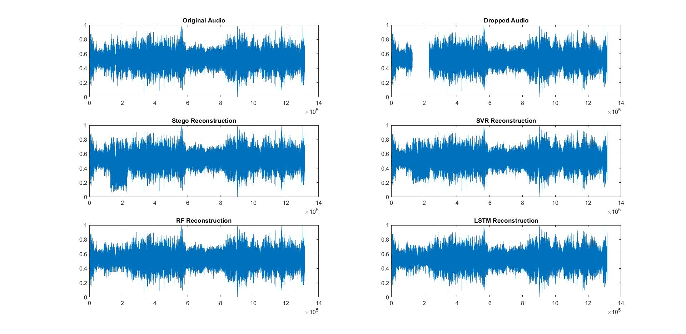

# ARMAS: Active Reconstruction of Missing Audio Segments

## Description

This research based project aims addresses the issues in several audio processing activities like lost audio transmissions and signals or corrupted audio files. To solve those issues and for possible enhancement of audio reconstruction, machine/deep learning models fusing steganography technique was explored. Experiments were conducted on corrupted audio files with short and long missing gaps which were filled with reconstructed signals with ML/DL models. The results from the experiments concluded that use of AI algorithms has a great impact on audio reconstruction.

## Results

The image below shows the reconstruction of lost audio signals with four different techniques: Steganoflage, Random Forest, SVR (Support Vector Regressor) and LSTM (Long Short Term Memory).

## Demo Audio

### Original Audio
https://user-images.githubusercontent.com/91117093/205602462-c61c9db8-b571-416c-9073-40c5c2eb0f68.mp4

### Dropped Audio
https://user-images.githubusercontent.com/91117093/205603165-438346c2-8824-44a6-8857-a8e4c87fef99.mp4

### Stego Reconstruction
https://user-images.githubusercontent.com/91117093/205603236-12e2026a-d170-4694-8e95-b5247d40986a.mp4

### Random Forest Reconstruction
https://user-images.githubusercontent.com/91117093/205603257-61d89bdc-a8b8-4d5a-a011-ef72fbda0227.mp4

### SVR Reconstruction
https://user-images.githubusercontent.com/91117093/205603303-6884b1a0-76d4-4bc0-9206-7e5bdb9ee67b.mp4

### LSTM Reconstruction
https://user-images.githubusercontent.com/91117093/205603364-32e6abaf-3a80-49b2-a77c-e9eb7bbb340d.mp4

